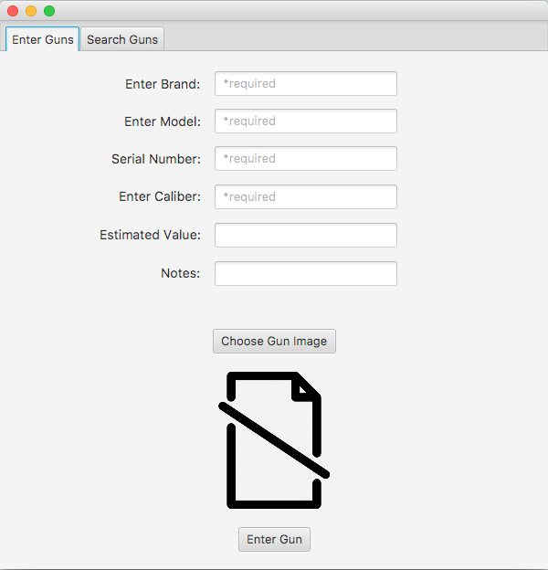
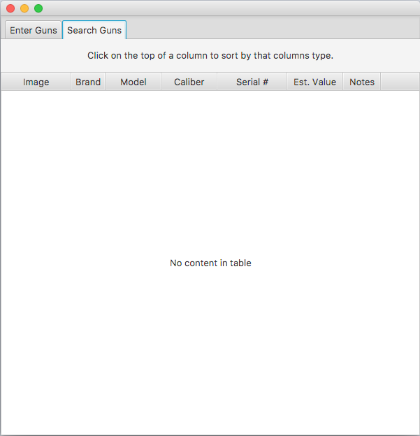

# ITEC_2905_CapstoneProject
## Synopsis

This is a program used for easily recording muliple firearms quickly. It also allows the user to quickly sort through their firearm collection by its brand, caliber, serial number, model, value, and most recently added.

## Motivation

I was motivated to create this project due to having multiple family members inquire of me to come and catalogue their firearms like I do for my grandfather. The way I handled cataloging process took forever, so instead I created this program to quicken the process.

## Installation

Download the zip file, and run Main.java with any IDE that supports javafx.

## Software and Resources used

All of the java code was written in Eclipse, while I wrote the FXML script in SceneBuilder.
Credits to Stack Overflow for troubleshooting various issues.

## GUI Example

This is how the GUI looks:

  

## Code Example

This code executes when a firearm is entered:

```
public void enterGun(ActionEvent Event) {
	//If checking to make sure the necessary fields are submitted
	if(tfBrand.getText().isEmpty() || tfModel.getText().isEmpty() || tfSerial.getText().isEmpty() || tfCaliber.getText().isEmpty() || tfEstValue.getText().isEmpty()) {
			
	} else {
		//Take everything from the textfields
		String brand = tfBrand.getText().trim();
		String model = tfModel.getText().trim();
		String serial = tfSerial.getText().trim();
		String caliber = tfCaliber.getText().trim();
		String toParse = tfEstValue.getText().replace('$', ' ').trim();
		double estValue = Double.parseDouble(toParse);
		String notes = tfNotes.getText().trim();
		Image image = ivPicture.getImage();

		//add gun to record
		Firearm gunToAdd = new Firearm(image, brand, model, serial, caliber, estValue, notes);
		gunCollection.add(gunToAdd);

		//update records
		storeGuns();

		//clear text fields
		tfBrand.setText("");
		tfModel.setText("");
		tfSerial.setText("");
		tfCaliber.setText("");
		tfEstValue.setText("");
		tfNotes.setText("");

		tfBrand.requestFocus();
	}
}
```

This code executes whenever the code stores the collection of firearms into the save file:

```
public void storeGuns() {		
		//store into file
		try {
			if(gunFile.delete()){
				System.out.println("File Cleared");
			    gunFile.createNewFile();
			}else{
			    //throw an exception indicating that the file could not be cleared
				System.out.println("Couldnt clear File");
			}
			
			FileOutputStream f = new FileOutputStream(gunFile);
			ObjectOutputStream o = new ObjectOutputStream(f);
			o.writeObject(gunCollection);
			o.close();
		} catch (FileNotFoundException e) {
			System.out.println("File not found");
		} catch (IOException e) {
			System.out.println("ADDSORTSTORE Error initializing stream\n"+e.getMessage());
			e.printStackTrace();
		}
	}
```

## Contributors

I would feel honored if anyone wanted to implement their own changes or offer suggestions! Feel free to contact me at my email at eternalgoat55@gmail.com!
